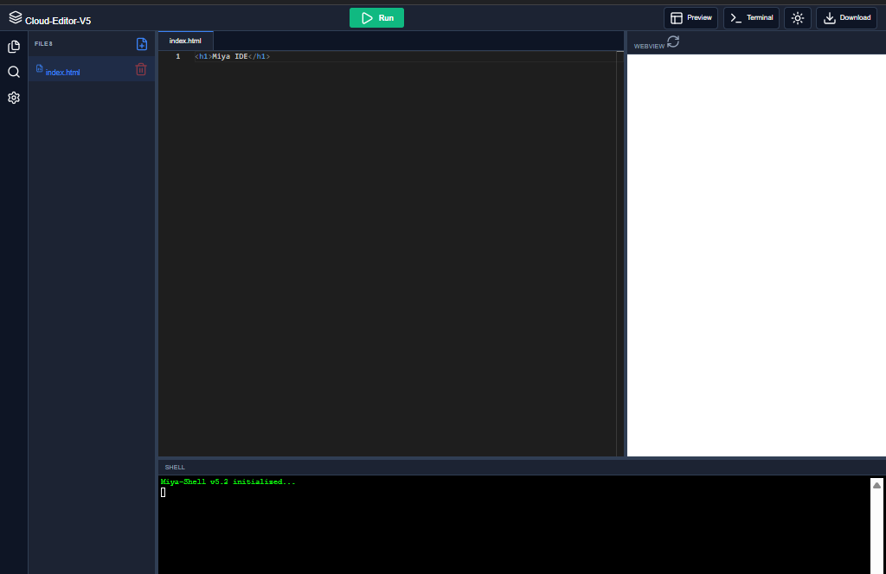

# 💻 Cloud-Powered Web Code Editor

A fast, lightweight, and modern web-based **Live Code Editor** built using **React** and the **Monaco Editor Framework**. This editor is specifically designed to write, manage, and preview **HTML, CSS, and JavaScript** structures in real-time.

---

## ⚡ Cloud-Powered Architecture

This project is completely serverless and lightweight. Instead of heavy local packages, all critical assets are fetched directly from the cloud:

- **Zero-Local Dependencies:** Monaco Editor core logic is bundled and streamed directly via CDN.
- **Cloud Icons & Fonts:** All file tree and UI icons are loaded dynamically through online icon packs (Devicons/FontAwesome).
- **Instant Load:** No heavy background compilation; your browser handles the execution instantly.

---

## 🚀 Features

- **Front-End Stack Focus:** Seamless tab switching between `index.html`, `style.css`, and `script.js` files.
- **VS Code Power in Browser:** Powered by Monaco Editor, providing syntax highlighting, auto-closing brackets, and smart IntelliSense.
- **Live Interactive Preview:** An integrated, secure iframe panel that renders your HTML/CSS/JS code changes instantly as you type.
- **File Tree Management:** A clean, sidebar navigation UI to switch between your frontend files.
- **Sleek Dark/Light UI:** Minimalist coding environment with built-in theme toggling.

---

## 🛠️ Tech Stack

- **React.js:** For building the interactive UI components and managing application state.
- **Monaco Editor (`@monaco-editor/react`):** The cloud-streamed code editor engine.
- **HTML5, CSS3, JavaScript (ES6):** The target languages managed inside the editor workspace.

---

## 📸 Demo



---

## 📂 Project Workspace Structure

```text
├── src/
│   ├── components/    # Sidebar, Editor Workspace, and Live Preview Iframe
│   ├── App.js         # Main layout aggregator and state manager
│   └── index.js       # React root configuration
├── public/            # Static wrappers
└── package.json       # App configuration
```

---

### 💻 3. CodeFlow-Live

## 🚀 How to Run Locally

### 1. Clone and Enter the Repository

```bash
git clone [https://github.com/amirsohail100/CodeFlow-Live.git](https://github.com/amirsohail100/CodeFlow-Live.git)
cd CodeFlow-Live
```
